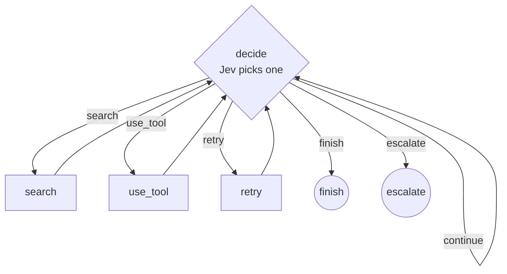
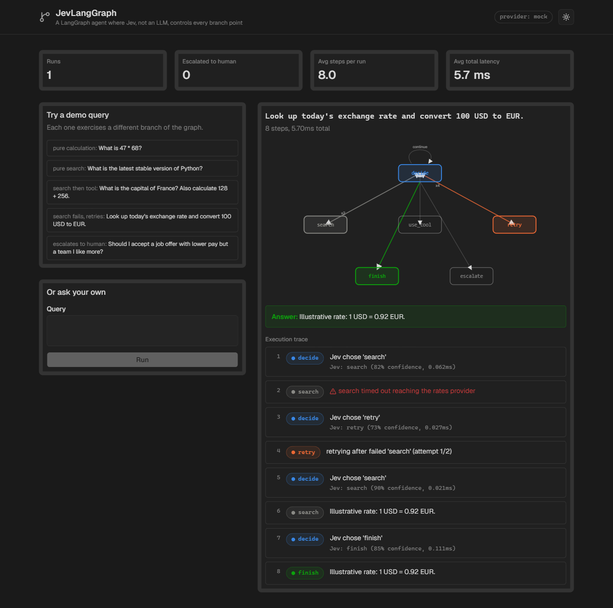
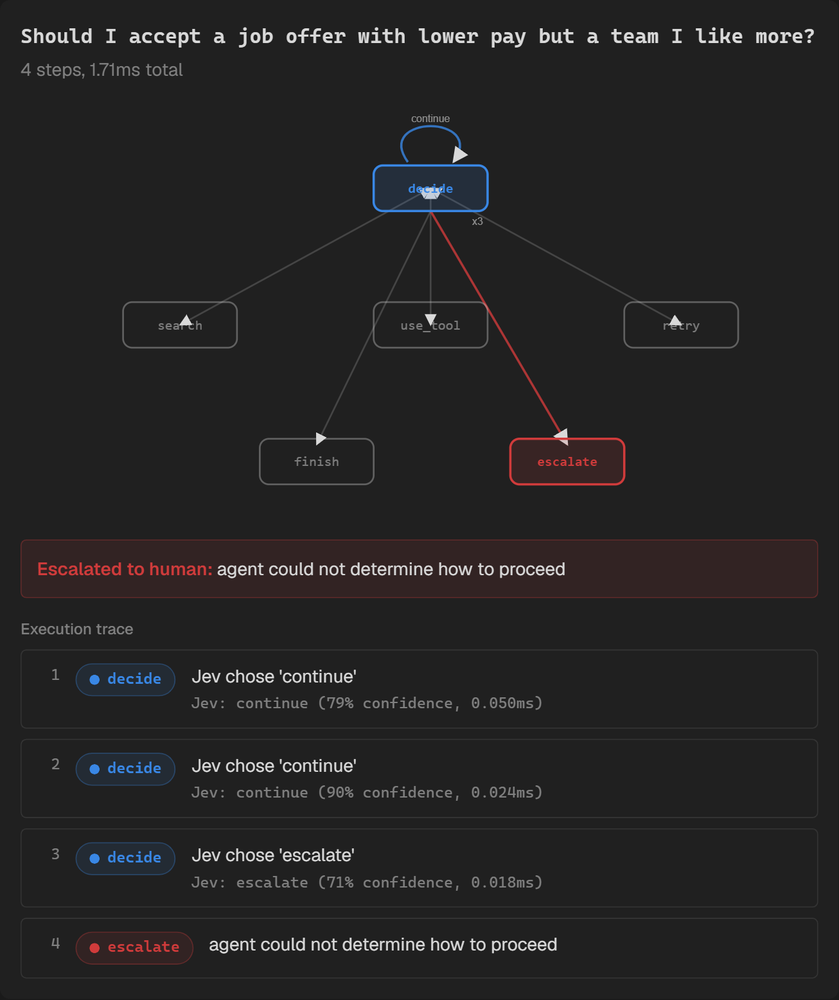

# JevLangGraph

A real [LangGraph](https://github.com/langchain-ai/langgraph) agent where **Jev, not an LLM, decides what to do next at every branch point**: `continue` (think one more step), `search`, `use_tool`, `retry`, `finish`, or `escalate` to a human.

```
query -> decide (Jev) -> search / use_tool / retry / finish / escalate -> back to decide -> ...
```

Fourth in the [Jev projects](../) series. Same conventions: FastAPI + Vite/React/shadcn, mock-first, zero cost by default.

## Why this, specifically

Most agent frameworks put an LLM call at every fork: "should I search, use a tool, or answer now?" is itself a prompt. That's slow and expensive for a decision that's often not open-ended reasoning — it's a bounded classification over a handful of options, which is exactly what Jev is built for. This project swaps that LLM call for one typed `Choice` question per branch point, and keeps everything else (the actual search/tool execution) as real, if simulated, work.

**No LLM calls anywhere in this project.** The graph nodes are genuine: `use_tool` runs a real, safe arithmetic evaluator (Python's `ast`, not `eval`) on expressions actually present in the query; `search` is a small deterministic lookup table standing in for retrieval. The only thing being demonstrated is the *control flow* — which is the part the original brief asked Jev to own.

## The graph

Built with `langgraph`'s `StateGraph` (`backend/app/graph.py`) — not a hand-rolled state machine dressed up to look like one:



A hard step-budget (`MAX_TOTAL_STEPS = 10`) forces escalation if the graph doesn't converge, so a run can never hang.

## Demo scenarios

Five queries, each exercising a different path — all 6 of Jev's possible decisions appear across the set:

| Category | Query | Path |
|---|---|---|
| Pure calculation | "What is 47 * 68?" | decide → use_tool → decide → finish |
| Pure search | "What is the latest stable version of Python?" | decide → search → decide → finish |
| Search + tool | "What is the capital of France? Also calculate 128 + 256." | decide → search → decide → use_tool → decide → finish |
| Search fails, retries | "Look up today's exchange rate and convert 100 USD to EUR." | decide → search **(fails)** → decide → retry → decide → search → decide → finish |
| Escalates to human | "Should I accept a job offer with lower pay but a team I like more?" | decide → decide → decide → escalate |

The "search fails, retries" scenario's failure is deterministic (the exchange-rate lookup fails specifically on its first attempt), not random — the demo is reproducible, not flaky-by-luck.

## Visualizing the graph and the trace

The dashboard shows two things together: a static diagram of the whole graph with the nodes and edges *this run actually used* highlighted in color (everything else fades to gray), and a numbered step-by-step trace below it showing Jev's actual choice, confidence, and latency at every `decide` call. The diagram answers "what's the graph's shape"; the trace answers "what exactly happened, in order" — a loopy graph can't show visit order on its own.

## Providers

Same three-provider abstraction as the rest of the series (`mock` default / `typesafe` / `jev_agent` — see [JevGuard's README](../jev-guard/README.md#providers)). The mock provider reads the **structured state dict** the `decide` node builds (query, prior steps, retry/reasoning counters) rather than parsing raw text — real Jev accepts structured JSON state the same way, so this isn't a mock-only shortcut.

## Setup

```bash
cp .env.example .env   # defaults to JEV_PROVIDER=mock, no key needed

# backend
cd backend
python -m venv .venv && .venv/Scripts/activate  # .venv/bin/activate on macOS/Linux
pip install -r requirements.txt
uvicorn app.main:app --reload --port 8000

# frontend (separate shell)
cd frontend
npm install
npm run dev
```

Or via Docker Compose from the project root:

```bash
docker compose up --build
```

Dashboard at `http://localhost:5176` (host), API at `http://localhost:8003` (host) — see `docker-compose.yml` for the port mapping.

## Tests

```bash
cd backend
pytest
```

Covers: the real arithmetic evaluator and the search lookup (including its deterministic failure), every demo scenario's expected path end-to-end, that the graph always terminates within the step budget, and a regression test for a bug caught while capturing screenshots (below).

## A bug this caught

The `retry` node's message originally read `retrying after failed 'decide'` — because it grabbed `steps[-1]`, which by construction is always the `decide` step that just chose "retry," not the action that actually failed. Fixed by searching backward for the most recent step with `failed=True`. Caught by actually reading the execution trace in the browser rather than just checking that the graph reached the right final node — the path was correct, the human-readable explanation of *why* was wrong. There's a regression test for it (`test_flaky_search_triggers_a_real_retry_then_succeeds`).

## Deployment

Deploys as a single Vercel project — import this repo, no configuration needed. `vercel.json` uses Vercel's explicit `builds`/`routes` config (more reliable for mixing a static build with a Python function than the buildCommand/outputDirectory zero-config style, which in practice let requests fall through to the API function instead of the static site): it builds the Vite frontend as the static site, deploys `api/index.py` as a Python function with `includeFiles: "backend/**"` (needed since the function imports from the sibling `backend/` directory, which Vercel doesn't bundle automatically otherwise), and routes `/api/*` to the function with everything else falling through to the static file system first, then `index.html`. `api/index.py` mounts the existing FastAPI app under `/api` with zero route changes, so the frontend's relative `/api/*` calls work on the same domain with no separate API URL to configure.

Defaults to `JEV_PROVIDER=mock` (no environment variables required to deploy). To run the deployed demo against a real Jev key, set `TYPESAFE_API_KEY` or `JEV_AGENT_KEY` and `JEV_PROVIDER` in the Vercel project's environment variables — see `.env.example`.

No persistence beyond the in-memory run log.

## Screenshots

**Dashboard** — the search-fails-and-retries scenario, graph diagram with the traversed path highlighted, full execution trace:



**Escalation scenario** — an ambiguous, subjective query: Jev chooses `continue` twice (thinking, no clear action available), then `escalate`:



## Limitations

- `search` is a small keyword lookup table, not real retrieval — it demonstrates the control-flow pattern, not a production search integration.
- The mock provider's decisions are keyword/state heuristics, same caveat as the rest of the series: its accuracy reflects the mock, not real Jev's actual judgment. Flip to a live provider to see the real thing.
- Five demo scenarios were chosen to hit all 6 possible decisions at least once; this isn't an exhaustive test of every graph path (e.g. an escalate-after-exhausted-retries path exists in the code but isn't separately demoed).
